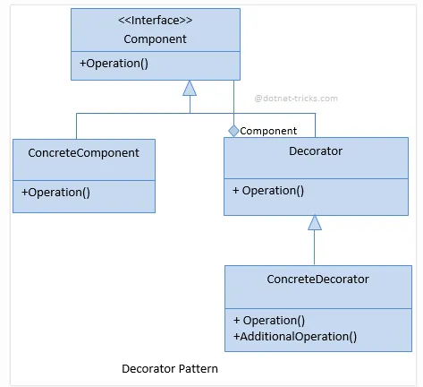
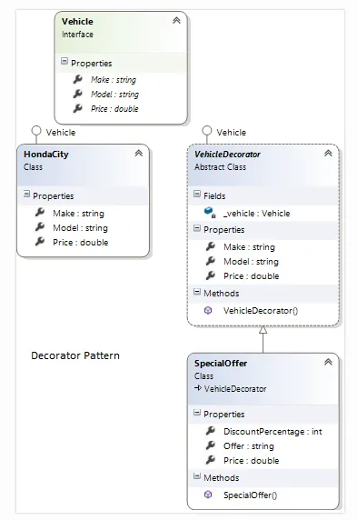
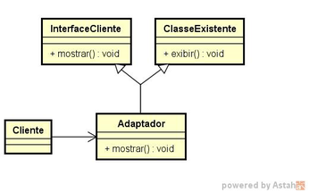
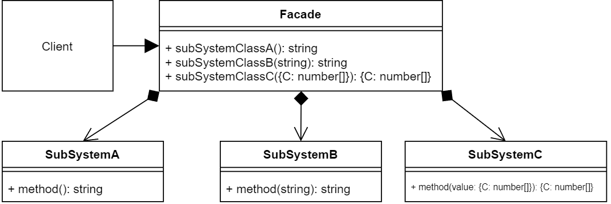
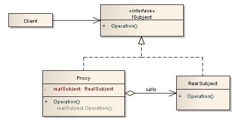

# ProjetoEArquitetura-hackatona
Trabalho será feito no dia 26.08 e visa criar uma competição entre grupos para criar projetinhos baseado em  Padrões Estruturais

Link para aula de padroes 

https://brpucrs-my.sharepoint.com/:p:/g/personal/10032614_pucrs_br/EU4Ccr-lIWdLhzmk_hkzyjAB_qeGHGpWZeTq6-LjYOGNHw?e=mNXL2o

UML de Decorator

UML Adapter

UML Facade

UML Proxy 

